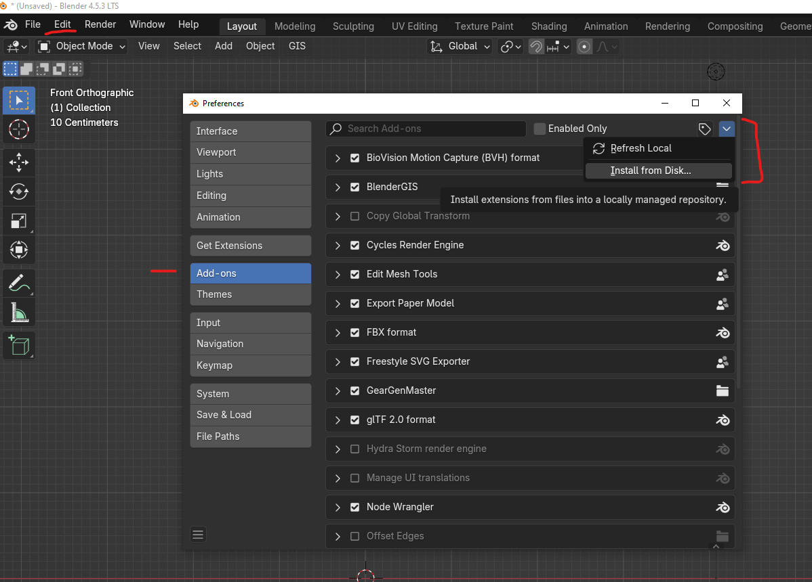
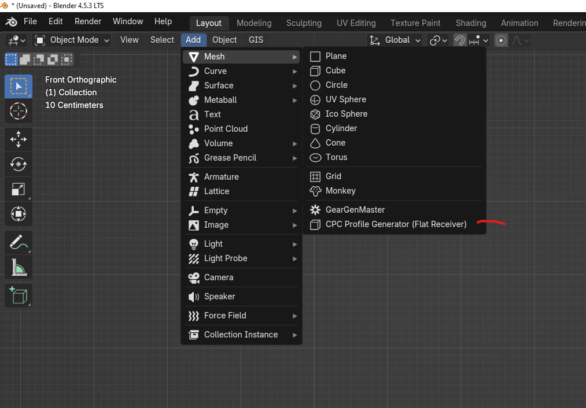
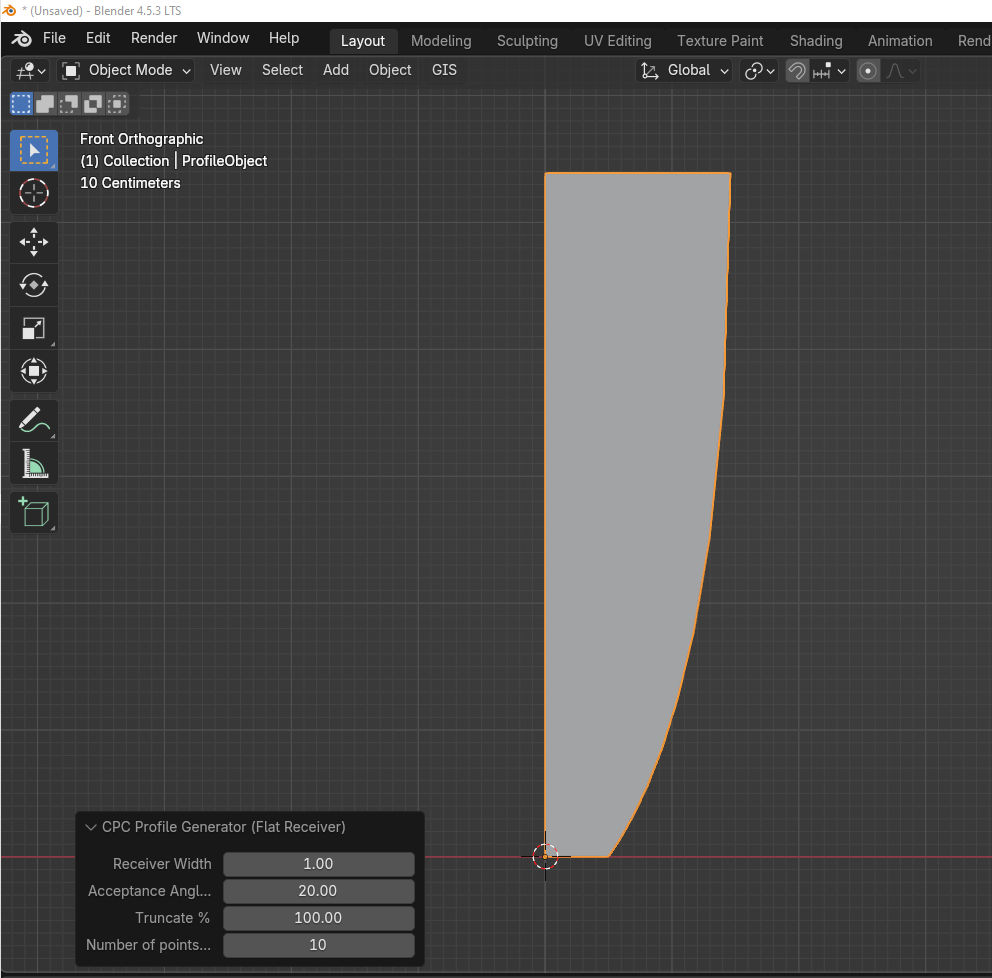

# BlenderCPC

Blender Add-on to create a Compound Parabolic Concentrator (CPC) 2D profile mesh from interactive user inputs.

Originally inspired by my CPC profile generator and adapted for use within Blender.

## Installation
- Standard Add-on installation

## Usage
- Screenshot showing menu item location

- Screenshot showing interactive UI and output mesh

